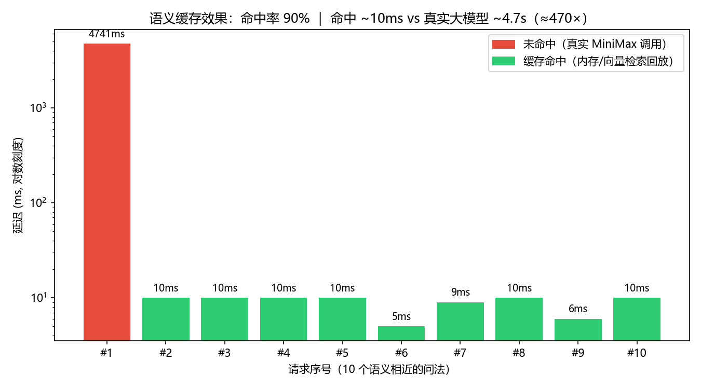

# LLM 网关（LLM Gateway）

高并发大模型统一接入网关。应用只需对接一个 OpenAI 兼容接口，由网关统一完成流式转发、语义缓存、多供应商路由、限流计费。

> 当前进度：M5（Prometheus 指标 / 可观测性）。设计文档见 `docs/superpowers/specs/2026-06-07-llm-gateway-design.md`。

## Docker 一键启动（推荐）

需要本机 Docker。一条命令拉起 网关 + Redis(向量后端) + Prometheus + Grafana：

```powershell
# 可选：把真实 key 放进环境（否则缓存/路由仍可跑，仅真实下游调用需要）
$env:MINIMAX_API_KEY = "你的key"
docker compose up -d --build
```

- 网关：http://127.0.0.1:8000 （`/health` `/metrics` `/v1/chat/completions` …）
- Prometheus：http://127.0.0.1:9090
- Grafana：http://127.0.0.1:3000 （匿名可看，数据源已自动配好 Prometheus）
- Redis Insight：http://127.0.0.1:8001

停止：`docker compose down`

## 快速开始（本地 venv）

```powershell
# 1. 建虚拟环境并装依赖
& "C:\Users\guantao\AppData\Local\Programs\Python\Python312\python.exe" -m venv .venv
.\.venv\Scripts\python.exe -m pip install -r requirements.txt

# 2. 配置 key
Copy-Item .env.example .env   # 然后编辑 .env 填入真实 key
# 当前默认供应商为 MiniMax：填 MINIMAX_API_KEY
# 注意区域：国内区 base_url 用 https://api.minimaxi.com/v1（api.minimax.io 是国际区，key 不通用）

# 3. 跑测试
.\.venv\Scripts\python.exe -m pytest -v

# 4. 启动服务
.\.venv\Scripts\python.exe -m uvicorn app.main:app --port 8000

# 5. 真实调用冒烟（另开一个终端）
.\.venv\Scripts\python.exe scripts/smoke_real_call.py
```

## 接口

- `GET /health` —— 健康检查
- `POST /v1/chat/completions` —— OpenAI 兼容的对话补全；`stream=true` 时走 SSE 流式转发，否则返回完整 JSON

## 压测（M2）

压测打**本地 Mock 上游**而非真实 API，这样测的是网关本身的转发/并发能力。

```powershell
# 终端 A：启动 Mock 上游（可调 token 数与每 token 延迟）
$env:MOCK_TOKENS = "20"; $env:MOCK_DELAY = "0.01"
.\.venv\Scripts\python.exe -m uvicorn mock_upstream.app:app --port 9000

# 终端 B：让网关的下游指向 Mock，再启动网关
$env:MINIMAX_BASE_URL = "http://127.0.0.1:9000/v1"
.\.venv\Scripts\python.exe -m uvicorn app.main:app --port 8000

# 终端 C：发起压测
.\.venv\Scripts\python.exe scripts/loadtest.py --concurrency 50 --total 500
```

输出示例：
`concurrency=50 total=500 wall=2.41s QPS=207.5 P50=210ms P95=360ms P99=520ms`

逐步加大 `--concurrency`（如 10 / 50 / 100 / 200）记录 QPS 与 P95/P99。

> ⚠️ **压测方法学说明**：要得到可信的 QPS，压测客户端应运行在**与网关不同的机器**上（或用 wrk/k6 专业工具从外部打）。若客户端、网关、Mock 上游挤在同一台机器，三者争抢 CPU 会严重低估异步服务器的真实吞吐——这是单机自压测的固有局限，本仓库的脚本仅用于本地功能验证与相对对比。

## 语义缓存（M3）

- 多级缓存：L1 精确（prompt 哈希）+ L2 语义（fastembed 向量 + 余弦相似度阈值）。
- 仅缓存低 temperature（`CACHE_MAX_TEMPERATURE`，默认 0.5）的请求，避免高随机性请求被错误命中。
- 向量存储可插拔：默认内存（`VECTOR_STORE_BACKEND=memory`），可选 Redis（`=redis`，需 Docker 起 redis-stack）。
- 命中即直接返回；流式命中则把缓存内容合成 SSE 回放，体验一致。
- 统计：`GET /cache/stats` 返回 hits/misses/l1_hits/l2_hits/hit_ratio。

### 实测效果（网关指向真实 MiniMax，10 个语义相近问法）



| 指标 | 实测 |
|---|---|
| 缓存命中率 | **90%**（7 次语义命中 L2 + 2 次精确命中 L1） |
| 命中延迟 | **~10ms**（内存/向量检索回放） |
| 未命中延迟 | **~4.7s**（真实大模型调用） |
| 加速 | **≈470×**，每次命中省去一次数秒级真实模型调用 |

跑命中率基准（先启动网关）：

```powershell
.\.venv\Scripts\python.exe -m uvicorn app.main:app --port 8000
# 另一个终端：
.\.venv\Scripts\python.exe scripts/cache_benchmark.py
```

可选启用 Redis 向量后端：

```powershell
# 需本机 Docker 已启动
docker run -d --name redis-stack -p 6379:6379 redis/redis-stack:latest
$env:VECTOR_STORE_BACKEND = "redis"
.\.venv\Scripts\python.exe -m uvicorn app.main:app --port 8000
```

## 鉴权 / 限流 / 计费（M4a）

- **鉴权**：所有 `/v1/*` 请求需带 `Authorization: Bearer <key>`；key 由 `GATEWAY_API_KEYS`（逗号分隔）配置，无效返回 401。
- **限流**：每个 key 按 `DEFAULT_RPM_LIMIT` 令牌桶限流，超限返回 429。
- **计费**：按 token 计量（`PRICE_PER_1K_TOKENS`），实时扣减配额（`DEFAULT_QUOTA_TOKENS`），耗尽返回 429。**缓存命中不计费**。
- **用量**：`GET /admin/usage` 查看每个 key 的 requests / used_tokens / remaining_tokens / cost。

示例：

```powershell
.\.venv\Scripts\python.exe -m uvicorn app.main:app --port 8000
# 带 key 调用：
curl -H "Authorization: Bearer dev-key" -H "Content-Type: application/json" `
  -d '{"model":"MiniMax-M2.5","messages":[{"role":"user","content":"hi"}],"temperature":0}' `
  http://127.0.0.1:8000/v1/chat/completions
# 看用量：
curl http://127.0.0.1:8000/admin/usage
```

## 多供应商路由 / 熔断降级（M4b）

- **路由链**：`PROVIDER_CHAIN`（逗号分隔的 provider 名，如 `minimax,deepseek`）按序尝试。
- **故障转移**：链中某 provider 调用失败，自动转移到下一个；流式仅在"首个分块前"可转移。
- **熔断**：每个 provider 一个熔断器，连续失败达 `CIRCUIT_FAILURE_THRESHOLD` 即熔断（跳过），冷却 `CIRCUIT_RECOVERY_TIMEOUT` 秒后半开探测，成功则恢复。
- **全部不可用** → 503。
- **状态**：`GET /admin/providers` 查看链与各 provider 熔断状态。

```powershell
$env:PROVIDER_CHAIN = "minimax,deepseek"
.\.venv\Scripts\python.exe -m uvicorn app.main:app --port 8000
curl http://127.0.0.1:8000/admin/providers
```

## 指标 / 可观测性（M5）

- `GET /metrics` 暴露 Prometheus 文本格式指标：
  - `gateway_http_requests_total{method,path,status}` —— 请求量
  - `gateway_http_request_duration_seconds{path}` —— 延迟直方图（可算 P50/P95/P99）
  - `gateway_cache_hits_total` / `gateway_cache_misses_total` —— 缓存命中/未命中
  - `gateway_tokens_total` —— 计费 token 总量
- 用 Prometheus 抓取 `/metrics`，再在 Grafana 出 QPS / 延迟分位 / 缓存命中率 大盘。

```powershell
.\.venv\Scripts\python.exe -m uvicorn app.main:app --port 8000
curl http://127.0.0.1:8000/metrics
```
